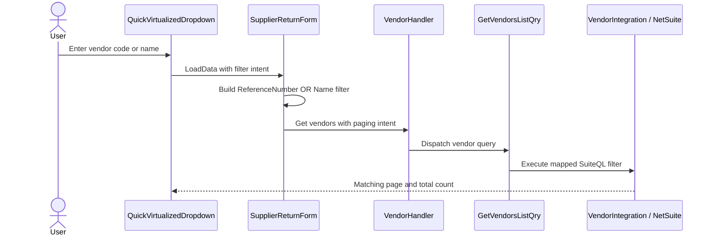

# IIL_258: Vendor Search on Return to Supplier

- **Date:** 2026-10-01
- **Status:** Confirmed
- **Mode:** BUGFIX
- **Scope:** Vendor search on the Return to Supplier (RTS) create form
- **Related:** None found

## Overview

Configure the RTS Vendor dropdown to pass search text to its data provider, then have that RTS-specific provider express the search as an OR filter across vendor reference and vendor name. Keep the existing handler and NetSuite query path, and preserve server-side paging and virtualization.

## Decision Record

- **Problem:** The Vendor dropdown does not provide a filter target. The shared dropdown therefore does not add the entered text to the data intent.
- **Search decision:** Search both `VendorVM.ReferenceNumber` and `VendorVM.Name` using contains semantics and OR logic. Continue displaying the vendor name in the selector.
- **Implementation boundary:** Configure the target in the RTS form and normalize the search filter in its provider. Do not change the shared dropdown API or other vendor selectors.
- **Query mapping:** The NetSuite vendor query selects reference and name fields. `SuiteQLQueryBuilder.Select` populates the property map used when translating intent filters, so filter descriptors can use vendor model property names.
- **Literal safety:** The query builder interpolates `Contains` values into the SuiteQL expression. Verify and ensure apostrophes in the search text are escaped in the vendor query path. Do not broaden this change into a general query-builder refactor.
- **Trade-offs:** The change is specific to RTS and adds vendor-specific normalization at the form provider. Existing dispatch, integration, paging, and display behavior are retained.

## What Already Exists

- The Vendor dropdown currently sets `TextProperty` but no `FilterTarget`: [SupplierReturnForm.razor](../../../Web.BlazorServer/Components/Pages/Transaction/SupplierReturn/Components/SupplierReturnForm.razor#L44).
- The vendor data provider is `VendorProvider`: [SupplierReturnForm.razor.cs](../../../Web.BlazorServer/Components/Pages/Transaction/SupplierReturn/Components/SupplierReturnForm.razor.cs#L125).
- The shared dropdown only adds an intent filter when a non-empty `FilterTarget` is configured: [QuickVirtualizedDropdown.razor.cs](../../../Web.BlazorServer/Components/Custom/QuickVirtualizedDropdown.razor.cs#L65).
- Vendor view data includes both `ReferenceNumber` and `Name`: [VendorVM.cs](../../../Web.BlazorServer/ViewModels/Others/VendorVM.cs#L6).
- The NetSuite query selects reference and name columns and applies the incoming data-grid intent: [VendorIntegration.cs](../../../Integration.NS/Implementations/Others/VendorIntegration.cs#L27).
- Selected aliases are added to the query builder's property map: [SuiteQLQueryBuilder.cs](../../../Integration.NS/Services/SuiteQLQueryBuilder.cs#L293). Its string `Contains` operation interpolates its value: [SuiteQLQueryBuilder.cs](../../../Integration.NS/Services/SuiteQLQueryBuilder.cs#L249).
- The existing request path is `VendorProvider` → `VendorHandler` → `GetVendorsListQry` → `VendorIntegration`. The handler dispatch is in [VendorHandler.cs](../../../Web.BlazorServer/Handlers/Implementations/Others/VendorHandler.cs#L11), and the query handler is in [GetVendorsListQry.cs](../../../Application.UseCases/Queries/Others/Vendor/GetVendorsListQry.cs#L14).
- No automated test project was found. No schema change is indicated.

The change is limited to RTS provider configuration and search-filter normalization, plus vendor-query literal handling if required. The shared dropdown contract, generic handler path, vendor display text, schema, and vendor-selection workflow remain unchanged.

## Verified Technologies and Constraints

- `Web.BlazorServer` and `Integration.NS` target .NET 8.
- The UI uses Radzen and the repository's `QuickVirtualizedDropdown` abstraction.
- Vendor retrieval uses the NetSuite integration, not SAP.
- Blazor components call through handler interfaces and do not access MediatR or integration services directly.
- `CLAUDE.md` and some `.claude` guidance describe an older LSMS/SAP-oriented layout; implementation decisions here follow the verified RTS source path.
- `CLAUDE.md` has conflicting branch timing instructions: create a fix branch before work versus creating/switching after a successful build. Resolve that workflow conflict before implementation.

## Components and Responsibilities

### RTS form

Set the vendor dropdown's filter target to the vendor reference property so the shared control passes typed text to the provider. In `VendorProvider`, replace the generated single-field filter with a grouped OR filter for contains matches on `ReferenceNumber` and `Name`. Preserve paging intent and other filters.

### Shared dropdown

No API or behavior change is planned. It remains responsible for Radzen loading, virtualization, and conveying the configured filter through `DataGridIntent`.

### Vendor handler and query

Keep the existing MediatR request/handler contracts and DTO-to-ViewModel mapping.

### NetSuite vendor integration

Continue selecting vendor reference and name, applying the data-grid intent, and mapping aliases to SQL columns. Ensure user-entered search text is treated as a literal for `Contains` filtering; keep any required escaping within this vendor query path.

### UI and data model

Keep the current name-only display. No DTO, ViewModel, schema, or submission changes are planned.

## Data Flow

## Correctness Properties

1. A partial or full vendor reference returns vendors whose reference contains the search text. _Requirements: 2.1_
2. A partial or full vendor name returns vendors whose name contains the search text. _Requirements: 2.2_
3. A vendor matching either field is included; a match on both fields is not required. _Requirements: 2.1, 2.2_
4. The search filter is applied before paging, and the returned count corresponds to filtered results. _Requirements: 2.3_
5. Blank search retains the existing initial list and paging behavior. _Requirements: 2.3_
6. No matches use the existing empty-results state. _Requirements: 2.4_
7. Selecting a filtered vendor preserves required validation and the existing dependent subsidiary workflow. _Requirements: 2.5_
8. Apostrophes in entered search text do not produce malformed SuiteQL. _Requirements: 2.1, 2.2_

## Error Handling and User-Visible Behavior

Retain the shared dropdown's loading/error action handling and existing empty template. Do not add new notifications or alter the current vendor display. A no-match query should resolve through the existing empty-results state.

## Validation Strategy

- **Before fix:** Reproduce code and name searches on the RTS create form and confirm the results do not narrow as expected.
- **After fix:** With development NetSuite access, check partial and full code matches, partial name matches, no matches, blank search, paging/virtualization, apostrophe input, and vendor selection.
- Confirm subsidiary selection, required validation, and dependent form behavior remain unchanged.
- Run the repository-prescribed shell probe followed by `dotnet build` from the solution root.
- No automated test project was found. Do not report automated regression coverage unless a suitable test surface is added separately.

## Property-Based Testing

**NOT APPLICABLE.** The behavior is a deterministic two-field substring filter; focused code/name examples and preservation checks cover the relevant properties without introducing a new testing framework.

## Accepted Consequences and Out of Scope

- Only the RTS Vendor dropdown gains the combined search behavior.
- Other vendor selectors, the shared dropdown API, vendor eligibility rules, form submission, and schema are not changed.
- Generic SuiteQL hardening is deferred; only literal handling required by this vendor search is in scope.

## Verification Checklist

- Code and name searches each return matching vendors.
- The OR filter, property-to-column mapping, filtered count, and paging are correct.
- Blank and no-match states remain correct.
- Apostrophe input is handled as literal search text.
- Vendor selection and dependent form behavior remain unchanged.
- The solution build succeeds.
