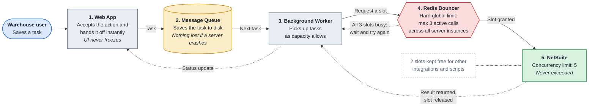

# WMS to NetSuite Request Flow

**Web App → Message Queue → Background Worker → Redis Bouncer → NetSuite**

## Flow

## Components

| # | Component | Role |
|---|---|---|
| 1 | **Web App** | Accepts the user's action and hands it off instantly, so the UI never freezes. |
| 2 | **Message Queue** | Saves the task to disk, so nothing is lost if a server crashes. |
| 3 | **Background Worker** | Picks up tasks from the queue as capacity allows. |
| 4 | **Redis Bouncer** | Enforces a hard global limit (max 3 active calls) across all server instances. |
| 5 | **NetSuite** | Receives requests without ever going over its concurrency limit of 5. |

## Reading the diagram

- **Solid arrows** are the main path a task takes from the user to NetSuite.
- **Bouncer → Worker (dotted):** when all 3 slots are busy, the worker waits and asks again.
- **NetSuite → Worker (dotted):** NetSuite returns the result and the slot is released.
- **Worker → Web App (dotted):** the worker reports the status back, so the user sees the task as done or as needing review.
- **Dotted note on NetSuite:** the limit of 3 leaves 2 of NetSuite's 5 slots free for other integrations and scripts.

## Implementation notes

- **Release a slot only when NetSuite responds**, never when the worker times out. NetSuite keeps processing a request after the caller gives up, so releasing early lets more than 3 calls run at once.
- **Give every slot an expiry time** (TTL) longer than the slowest NetSuite call, so a crashed worker doesn't hold its slot forever.
- **Make retries safe.** Stamp each NetSuite transaction with the WMS transaction ID, and check for it before creating, so a retry after a timeout never creates a duplicate.

---

## In plain terms

Think of NetSuite as a government office with **only 5 service windows**. If too many people rush the windows at once, the office turns them away. That is what happens today when 30 warehouse users save at the same time: saves fail, or the app freezes while it waits.

The new setup works like a well-run reception desk:

1. **Web App: the front desk.** You hand in your form (a receipt, a transfer, a pick, a vendor return) and get a "Received" right away. You don't stand there waiting, so you can go straight to your next task.
2. **Message Queue: the filing tray.** Every form goes into a locked tray before anything else happens. If the power goes out or a computer restarts, the forms are still in the tray. Nothing is lost.
3. **Background Worker: the runner.** A staff member takes forms from the tray one by one and carries them to the office.
4. **Redis Bouncer: the doorman.** The doorman lets only 3 of our runners inside at a time, no matter how many runners we have. If all 3 spots are taken, the next runner waits a moment at the door.
5. **NetSuite: the office.** It never gets crowded, so every form is accepted. The 2 windows we leave free are for NetSuite's own work and our other systems.

When the office finishes a form, the runner brings back the result and the app updates your task to **Done**. If something is wrong with the form, such as not enough stock in the bin, it comes back to you to fix and send again.

### What the warehouse team will notice

| Before | After |
|---|---|
| Screen freezes while saving | Saves take about a second, then you move on |
| "Too many requests" errors at busy times | Busy times only mean a short wait in line, not an error |
| Work lost if the app crashes | Work is kept safe and posts once the system is back |
| The same transaction sometimes posted twice | Each task posts exactly once |
| Records appear in NetSuite instantly or not at all | Records appear in NetSuite shortly after saving: usually seconds, a few minutes at the busiest times |
