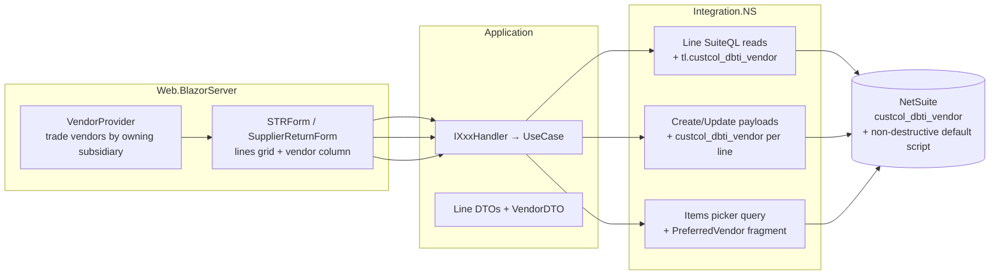

# Design Document: Preferred Vendor per Line (STR + RTS)

## Decision Record

**Problem.** Preferred Vendor exists only at the STR header (returns-only
posting), while the business needs it required and editable per item line on STR
(TO/ITO/Return) and RTS, stored on the NetSuite transaction line.

| # | Decision | Rationale |
|---|----------|-----------|
| D1 | Store per-line vendor in `custcol_dbti_vendor` on the transaction line | Field exists, is populated, per-transaction by nature (satisfies 2.5). |
| D2 | Reuse the existing `VendorProvider` / `VendorSubsidiary` logic (current uncommitted work) for the line dropdown | Already correct: trade vendors scoped to owning subsidiary; semaphore leak fixed. Do not rebuild. |
| D3 | Default at line-add time in the WMS from `itemvendor.preferredvendor` (subsidiary-scoped) via a new `SuiteQLFragments.PreferredVendor()`; treat the NS defaulting script as a safety net | Immediate UX feedback in the form; NS script (non-destructive) backfills anything missed. They compose because the script never overwrites. |
| D4 | Submit-time validation in `.razor.cs` naming line numbers — NOT per-row `RadzenRequiredValidator` | Grid rows share one column template; validator-by-Name does not work per row. Codebase convention: validation lives in code-behind (blazor_conventions.md:102-107). |
| D5 | Do NOT set line fields on the RTS create-from-PO `!transform` call | Transform payload shape for line fields is unverified (R2); NS script backfills on save; user can edit after. Avoids a brittle guess. |
| D6 | Line dropdown uses `AllowClear=false` | Required field: clearing should be impossible; validation is the backstop (2.8). |
| D7 | Header vendor field restricted to Return categories via `Visible="@Model.IsReturn"` | Fixes defect 1.2 (silent drop on TO/ITO) with a one-attribute change; preserves Receiving dependency (3.2). |

**Trade-offs.** (a) WMS-side default duplicates the NS script's defaulting logic —
accepted: the WMS default is UX-only, NetSuite remains authoritative, and drift
risk is low (both read `itemvendor.preferredvendor`). (b) Returns now require
BOTH header vendor and per-line vendors — business-confirmed duplication;
revisit only if users complain. (c) One more per-row virtualized dropdown —
same pattern as the existing UoM column; no new perf concern.

## What Already Exists (verified)

- Line reads: `StockTransferRequestIntegration.cs:222-261` (SuiteQL, inline
  builder); `SupplierReturnIntegration.cs:100-129` and `:307-336` (PO-sourced).
- Payloads: `StockTransferRequestIntegration.cs:353-400` (`CreateSTRPayload`,
  lines at :383-396; used by BOTH create :279-296 and update :298-314 with
  `?replace=item`); `SupplierReturnIntegration.cs:396-425` (`CreatePayload`,
  lines at :412-421); PO transform at `:236-258`.
- Read/mapping precedent for a vendor field pair: header read
  `StockTransferRequestIntegration.cs:158` (`BUILTIN.DF(...)`) + `:165` (raw id)
  + `:198` (map to `VendorDTO`).
- `SuiteQLFragments` pattern (`Integration.NS/Helpers/SuiteQLFragments.cs`,
  `PreferredBin()` :41-52) and the itemvendor join SQL to copy
  (`NS_TransferOrder_Get_Items.sql:69-80`).
- Item picker query: `ItemsIntegration.GetItemsByLocationDataGridAsync`
  (`ItemsIntegration.cs:58-94`, already consumes `SuiteQLFragments.PreferredBin`
  at :86); consumed by `STRForm.razor.cs:130-154` and
  `SupplierReturnForm.razor.cs:283-308`.
- Per-line dropdown precedent: UoM column `STRForm.razor:219-228` with
  `SetLineUoM` (`STRForm.razor.cs:620-628`); `SupplierReturnForm.razor:118-125`.
- Vendor provider ready-made: `STRForm.razor.cs:221-256` (`VendorSubsidiary`,
  `VendorProvider`, `VendorSet`) and the header vendor provider in
  `SupplierReturnForm.razor.cs` (used by `SupplierReturnForm.razor:40-50`).
- Root cause evidence: the old line column bound to a line `Vendor` that no
  query selected and no payload posted — dead end-to-end.

**What changes:** the two line read queries (+ PO-sourced RTS query), the two
payloads, four line models (NSDTO/DTO/VM ×2), the item picker query + its
models, both forms (one column each), STR header visibility, submit validation.
**What does not change:** header `custbody_dbti_return_to_vendor` posting, RTS
`entity`, Receiving reads, all NSScripts, packing/mobile flows, update
endpoints, architectural debts.

## Overview & Principles

Blazor Server (.NET 8) → `IXxxHandler` → MediatR → `Integration.NS` → NetSuite
(REST records + SuiteQL). Design follows: handler-dispatch stays in Web (Debt 5,
intentional); DTOs are layer contracts; Mapster maps by name at the NSDTO→DTO
and DTO→VM seams; validation lives in code-behind; no new test infrastructure.

## Components & Data Models

**Integration.NS**
- `StockTransferRequestLineNSDTO` += `VendorId (long?)`, `VendorName (string?)`;
  query selects `("tl.custcol_dbti_vendor", VendorId)` +
  `("BUILTIN.DF(tl.custcol_dbti_vendor)", VendorName)`; map to
  `VendorDTO? Vendor` in the existing `Adapt` block (:254-260).
- `SupplierReturnLineNSDTO` += same pair; applied in both RTS line queries;
  mapped in `ConvertLineDTO` (:433-440).
- `CreateSTRPayload` line items += `custcol_dbti_vendor = line.Vendor is not null
  ? new { id = line.Vendor.Id.ToString() } : null` (object shape per :376
  precedent). Same for `SupplierReturnIntegration.CreatePayload`. No `IsReturn`
  gate — all categories.
- `SuiteQLFragments.PreferredVendor(long subsidiaryId)` — derived table over
  `itemvendor WHERE preferredvendor = 'T' AND subsidiary = @subsidiary`,
  modeled on `PreferredBin()` and `NS_TransferOrder_Get_Items.sql:69-80`;
  consumed by the items picker query (subsidiary = document source subsidiary).

**Application.DataTransferObjects** — `StockTransferRequestLineDTO` +=
`VendorDTO? Vendor`; `SupplierReturnLineDTO` += same; items-grid DTO +=
preferred vendor id/name.

**Web.BlazorServer** — `StockTransferRequestLineVM` += `VendorVM? Vendor`
(nullable; NOT `= new()`); `SupplierReturnLineVM` += same. STR grid: new column
per D4/D6, `RadzenText` in read mode showing `data.Vendor?.Name ?? "Not set"`.
RTS grid: same; uses existing header `VendorProvider`. Header field:
`Visible="@Model.IsReturn"` on the column (D7); validator visibility gated the
same. Submit validation (both forms): collect line numbers where `Vendor is
null`; if any, `ToastService.Error("Preferred Vendor is required on line(s):
…")` and abort.

## Correctness Properties

- **P1** (2.1/2.2): For any STR category or RTS document in edit mode, every
  rendered line exposes a vendor dropdown bound to that line's `Vendor`.
- **P2** (2.3): For any item added from the picker with a preferred vendor in
  the document subsidiary, the new line's `Vendor` equals that vendor; items
  without one yield null.
- **P3** (2.4): For any create or update, the payload's item sublist contains
  `custcol_dbti_vendor` for every line with a selected vendor, for ALL
  categories; update includes every line (no wipe).
- **P4** (2.5): The payload contains no write to `itemvendor` or any other
  record; only the transaction line field.
- **P5** (2.6): For any existing document, the grid displays the stored line
  vendor, or "Not set" when null.
- **P6** (2.7): The header vendor field renders iff `Model.IsReturn`; the
  payload includes `custbody_dbti_return_to_vendor` iff Return.
- **P7** (2.8): For any submit where a line vendor is null, the request aborts
  before the integration call and the toast lists those line numbers.
- **P8** (3.1-3.3): RTS `entity`, return header posting, Receiving reads, and
  NSScripts behave byte-identically to before.
- **P9** (2.3/Q4): After save, a WMS-set override remains in NetSuite (the NS
  script never overwrites non-empty values) — verified manually in DEV.

## Error Handling

- Invalid/unknown vendor id (e.g., vendor outside the subsidiary): NetSuite
  rejects the document; the error surfaces through the existing integration →
  handler → toast path. No new error infrastructure (Debt 4: do not unify).
- Field ID drift (field renamed NetSuite-side): SuiteQL/payload failures surface
  loudly on read; caught in DEV verification.

## Testing Strategy

**Limitation (per skill rules): no test projects exist in `WMS.slnx`; no
automated tests are introduced.** Verification is `dotnet build` plus a manual
DEV/TC matrix:
1. Create/edit/view per document type: TO, ITO, Return-Good, Return-Bad, RTS,
   RTS-from-PO.
2. Override persistence: set a non-default vendor, save, re-open in NetSuite →
   value retained (P9); WMS re-read shows it (P5).
3. Update round-trip: edit an existing document without touching vendors →
   vendors retained after save (P3, `?replace=item`).
4. Validation: clear-to-null is impossible (D6); force null via fresh
   no-default item → submit blocked, toast names line (P7).
5. Header: hidden on TO/ITO, visible+required on Returns (P6).

**PBT assessment: NOT APPLICABLE** — no test infrastructure exists; behavior is
UI- and NetSuite-integration-bound (external system), not pure logic.

## Blast Radius

STR form + RTS form (UI), two integration classes, four line models, items
picker query/models, `SuiteQLFragments`. Untouched consumers: Receiving,
Packing, Mobile, Inventory Counting (verified: line DTOs are consumed only by
STR/RTS form paths; packing uses separate payload DTOs).

## Accepted Consequences & Out-of-Scope

- RTS-from-PO lines receive vendors via NS script on save, not at creation (R2).
- Duplicate vendor capture on Returns (header + lines) — business decision.
- Verification checklist before merge: `custcol_dbti_vendor` present on TO and
  VRA lines (SuiteQL probe); NS script confirmed to run on VRA saves;
  `custcol_dbti_created_vendor_returns` confirmed unmodified.